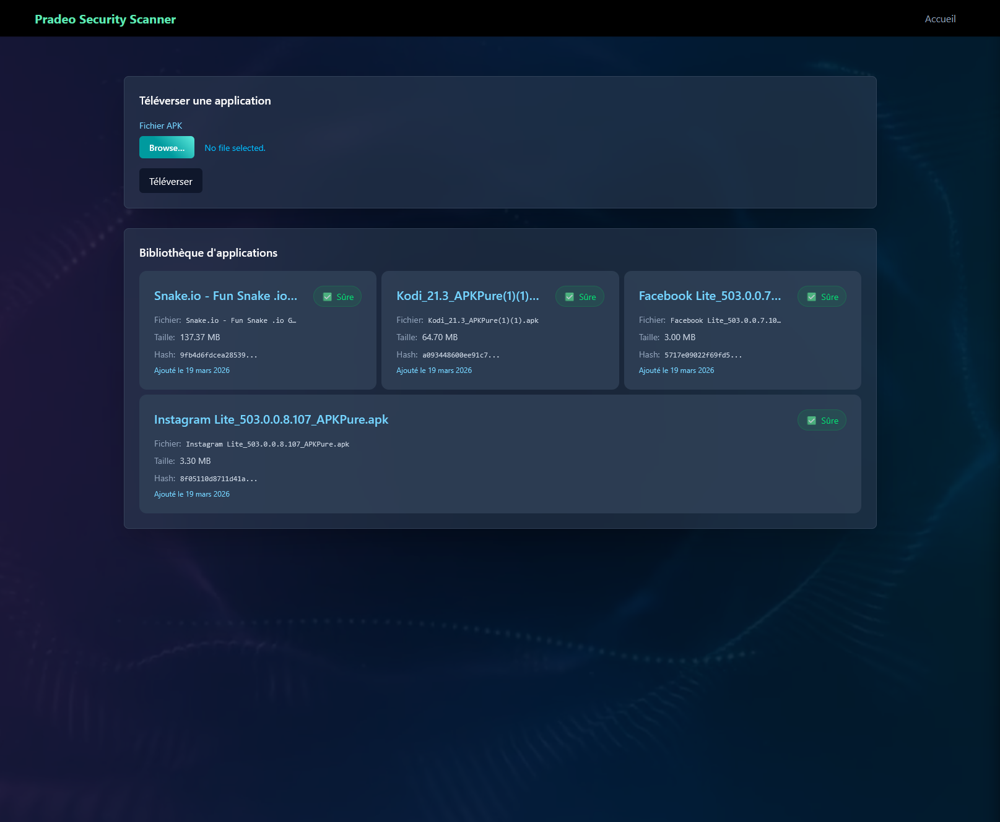

# Check Dat App

A full-stack monorepo application built with SolidJS, NestJS, PostgreSQL, and Redis.



## 🏗 Architecture

This project is structured as a **monorepo** using [pnpm workspaces](https://pnpm.io/workspaces) and [Lerna](https://lerna.js.org/) for package management and script execution.

It is split into two primary applications under the `apps/` directory:

1. **Frontend (`apps/frontend`)**
   - **Framework:** [SolidJS](https://www.solidjs.com/)
   - **Styling:** Tailwind CSS v4
   - **Build Tool:** Vite
   - **Role:** Handles the user interface and client-side logic.

2. **Backend (`apps/backend`)**
   - **Framework:** [NestJS](https://nestjs.com/) (Node.js)
   - **Database ORM:** TypeORM with PostgreSQL
   - **Queue/Background Jobs:** BullMQ with Redis
   - **Validation:** Zod and class-validator
   - **Role:** REST API, background processing, and database management.

3. **Infrastructure (Docker)**
   - **Postgres:** Primary relational database.
   - **Redis Stack:** Used by BullMQ for handling asynchronous background queues/jobs.
   - **Adminer:** Web-based GUI for local database management (Dev only).

---

## 🚀 How to Start (Local Development)

### Prerequisites

- **Node.js**: `>= 22`
- **pnpm**: `>= 10`
- **Docker & Docker Compose**

### 1. Install Dependencies

From the root of the monorepo, run:

```bash
pnpm install
```

### 2. Environment Setup

You need three `.env` to be set up: one for Docker, one for the frontend (optional in dev) and one for the backend.

```sh
cp .env.example .env
cp ./apps/frontend/.env.example ./apps/frontend/.env
cp ./apps/backend/.env.example ./apps/backend/.env
```

_(Note: Ensure these match what you want Docker to provision)._

### 3. Start Infrastructure (Database & Redis)

Start the PostgreSQL and Redis containers using the provided Docker Compose configuration:

```bash
pnpm docker
```

_Wait a few moments for the database to fully initialize._

### 4. Start the Application

To run both the frontend and backend development servers simultaneously in watch mode:

```bash
pnpm run dev
```

Alternatively, to start the backend with debugging enabled, run:

```bash
pnpm run start:server
```

---

## 🧠 Core Concepts & Tooling

- **Background Processing:** The backend leverages **BullMQ** and **Redis** to offload heavy tasks into background queues, preventing the main NestJS event loop from blocking.
- **Strict Configuration Validation:** The backend uses **Zod** to validate environment variables at startup, failing fast if the environment is misconfigured.
- **High-Performance Linting:** Instead of standard Prettier/ESLint for everything, this repo utilizes **Oxlint** and **Oxfmt** (part of the Oxc toolchain) for blazingly fast linting and formatting.
- **Conventional Commits:** The repository enforces semantic commit messages using `commitlint` and `husky` pre-commit hooks, which ties into Lerna's automated versioning and release system.
- **Monorepo Management:** The project uses **Lerna** to manage the monorepo structure, allowing for shared dependencies and streamlined releases.
- **Frontend and Backend comunication:** The frontend and backend communicate via a hyprid approach using REST CRUD endpoints for creating, updating and deleting data and Server-Sent Events (SSE) for notifications and real-time updates.
